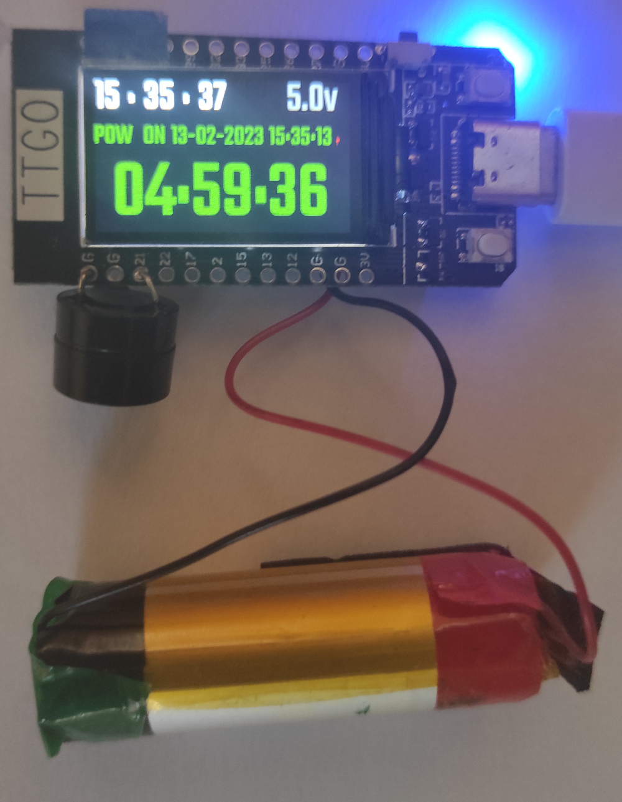

# Blackout watches Arduino ESP32 TTGO T-Display

## About device

Due to rolling emergency power outages in Ukraine, it became necessary to create a clock that counts the time from the last power state change and creates a forecast for turning on / off the electricity.
The electricity supply company provided the following schedule (which is not adhered to): 5 hours with electricity, 4 without.

- The clock counts down the time until the possible connection of electricity, the green color of the countdown, if the turn-on time is more than 5 hours, the time will be counted with a minus sign.
- The clock counts down the time until a possible power outage, the red color of the countdown, if the turn-on time is more than 4 hours, the time will be counted with a minus sign.
- The clock displays a real-time clock that is synchronized via the Internet 5 minutes after the power is restored.
- The clock displays the date and time of the last power change event.
- The clock displays the current supply voltage.
- Changes in on/off status are accompanied by an audible signal.
- 15 minutes before the power is turned off, the clock warns of a possible shutdown (in order to perform the necessary actions, for example, turn on the electric kettle)
- At night (according to the settings from 11 pm to 10 am), the brightness of the screen glow is reduced for a more comfortable perception, and the sounds of events are also not reproduced.

  

## Assembly

The clock is based on the ESP32 TTGO T-Display module https://github.com/Xinyuan-LilyGO/TTGO-T-Display and uses a minimum of details:

1. ESP32 TTGO T-Display Module
2. Battery 18650 lit-ion 2000 mAh 3.7v (taken from a disposable cigarette)
3. Active Buzzer TMB12A05

Solder the battery to the power connector wires, solder the Buzzer to G and pin 21. The case is the standard package of the ESP32 TTGO T-Display module.
Development was carried out using Visual studio code https://code.visualstudio.com/ and Platform IO plugin https://platformio.org/